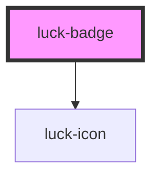

# luck-badge

<!-- Auto Generated Below -->

## Overview

Selo curto de status. `accent` para disponibilidade e destaques; `company` (azul) só para empresas;
`knowledge` (roxo) só para conhecimentos; `danger` para erro.

## Properties

| Property | Attribute | Description                         | Type                                                            | Default     |
| -------- | --------- | ----------------------------------- | --------------------------------------------------------------- | ----------- |
| `dot`    | `dot`     | Ponto que "respira" antes do texto. | `boolean`                                                       | `false`     |
| `icon`   | `icon`    | Ícone Lucide antes do texto.        | `string \| undefined`                                           | `undefined` |
| `tone`   | `tone`    |                                     | `"accent" \| "company" \| "danger" \| "knowledge" \| "neutral"` | `"neutral"` |

## Slots

| Slot | Description    |
| ---- | -------------- |
|      | Texto do selo. |

## Dependencies

### Depends on

- [luck-icon](../luck-icon)

### Graph

----------------------------------------------

