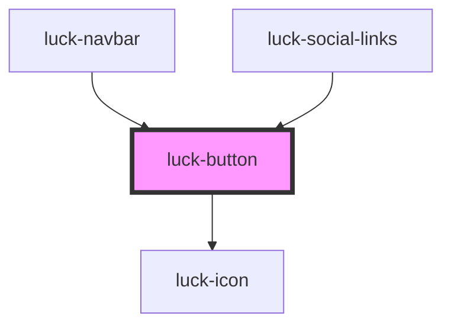

# luck-button

<!-- Auto Generated Below -->

## Overview

Botão tátil (tecla): afunda ao pressionar e volta com mola. `primary` para a ação principal
(uma por área), `secondary` para alternativas e `ghost` para baixa ênfase.

## Properties

| Property    | Attribute    | Description                                                            | Type                                  | Default     |
| ----------- | ------------ | ---------------------------------------------------------------------- | ------------------------------------- | ----------- |
| `disabled`  | `disabled`   |                                                                        | `boolean`                             | `false`     |
| `download`  | `download`   |                                                                        | `string \| undefined`                 | `undefined` |
| `fullWidth` | `full-width` | Ocupa toda a largura disponível.                                       | `boolean`                             | `false`     |
| `href`      | `href`       | Com `href`, renderiza um link com a mesma aparência.                   | `string \| undefined`                 | `undefined` |
| `iconLeft`  | `icon-left`  | Ícone Lucide antes do rótulo.                                          | `string \| undefined`                 | `undefined` |
| `iconRight` | `icon-right` | Ícone Lucide depois do rótulo. Setas "voam" no hover; download "cai".  | `string \| undefined`                 | `undefined` |
| `loading`   | `loading`    | Troca o conteúdo por um spinner, mantendo a largura.                   | `boolean`                             | `false`     |
| `magnetic`  | `magnetic`   | Puxa o botão em direção ao cursor (intensidade via `--motion-magnet`). | `boolean`                             | `false`     |
| `rel`       | `rel`        |                                                                        | `string \| undefined`                 | `undefined` |
| `size`      | `size`       |                                                                        | `"lg" \| "md" \| "sm"`                | `"md"`      |
| `success`   | `success`    | Troca o conteúdo por um ✓ desenhado.                                   | `boolean`                             | `false`     |
| `target`    | `target`     |                                                                        | `string \| undefined`                 | `undefined` |
| `type`      | `type`       |                                                                        | `"button" \| "reset" \| "submit"`     | `"button"`  |
| `variant`   | `variant`    |                                                                        | `"ghost" \| "primary" \| "secondary"` | `"primary"` |

## Events

| Event       | Description              | Type                |
| ----------- | ------------------------ | ------------------- |
| `luckBlur`  | Emitido ao perder foco.  | `CustomEvent<void>` |
| `luckFocus` | Emitido ao receber foco. | `CustomEvent<void>` |

## Methods

### `setFocus() => Promise<void>`

Move o foco para o botão.

#### Returns

Type: `Promise<void>`

## Slots

| Slot | Description      |
| ---- | ---------------- |
|      | Rótulo do botão. |

## Shadow Parts

| Part        | Description                    |
| ----------- | ------------------------------ |
| `"control"` | O `<button>` ou `<a>` interno. |

## Dependencies

### Used by

 - [luck-navbar](../luck-navbar)
 - [luck-social-links](../luck-social-links)

### Depends on

- [luck-icon](../luck-icon)

### Graph

----------------------------------------------

