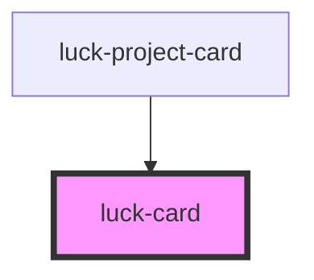

# luck-card

<!-- Auto Generated Below -->

## Overview

Superfície elevada com barra de título (índice âmbar, rótulo mono, dica e três pontos).
A luz segue o cursor; com `tilt`, o card inclina em 3D.

## Properties

| Property      | Attribute     | Description                                                                    | Type                   | Default     |
| ------------- | ------------- | ------------------------------------------------------------------------------ | ---------------------- | ----------- |
| `bar`         | `bar`         | Força mostrar/ocultar a barra. Padrão: aparece quando há `heading` ou `index`. | `boolean \| undefined` | `undefined` |
| `heading`     | `heading`     | Rótulo da barra de título (mono, maiúsculo).                                   | `string \| undefined`  | `undefined` |
| `hint`        | `hint`        | Dica à direita da barra.                                                       | `string \| undefined`  | `undefined` |
| `index`       | `index`       | Índice âmbar na barra: `01`.                                                   | `string \| undefined`  | `undefined` |
| `interactive` | `interactive` | Luz âmbar sob o cursor.                                                        | `boolean`              | `true`      |
| `padded`      | `padded`      | Aplica o padding padrão (22 px) ao conteúdo.                                   | `boolean`              | `true`      |
| `tilt`        | `tilt`        | Inclinação 3D (intensidade via `--motion-tilt`).                               | `boolean`              | `false`     |

## Slots

| Slot | Description       |
| ---- | ----------------- |
|      | Conteúdo do card. |

## Shadow Parts

| Part     | Description         |
| -------- | ------------------- |
| `"bar"`  | A barra de título.  |
| `"body"` | A área de conteúdo. |
| `"card"` | A superfície.       |

## Dependencies

### Used by

 - [luck-project-card](../luck-project-card)

### Graph

----------------------------------------------

