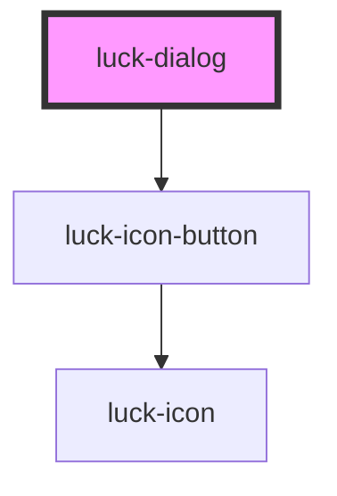

# luck-dialog

<!-- Auto Generated Below -->

## Overview

Diálogo modal sobre `<dialog>` nativo (foco preso, Esc, camada superior). Fecha por Esc, clique
no fundo ou no botão ×; em todos os casos emite `luckClose` e define `open = false`.

## Properties

| Property      | Attribute     | Description                                                              | Type                  | Default     |
| ------------- | ------------- | ------------------------------------------------------------------------ | --------------------- | ----------- |
| `closeLabel`  | `close-label` | Nome acessível do botão de fechar.                                       | `string`              | `"Fechar"`  |
| `description` | `description` | Texto de apoio abaixo do título.                                         | `string \| undefined` | `undefined` |
| `heading`     | `heading`     | Título do diálogo (também é o nome acessível).                           | `string \| undefined` | `undefined` |
| `open`        | `open`        | Abre ou fecha o diálogo.                                                 | `boolean`             | `false`     |
| `persistent`  | `persistent`  | Impede fechar pelo fundo e por Esc (use para confirmações obrigatórias). | `boolean`             | `false`     |
| `width`       | `width`       | Largura máxima do painel em px.                                          | `number`              | `480`       |

## Events

| Event       | Description                                                  | Type                                                                       |
| ----------- | ------------------------------------------------------------ | -------------------------------------------------------------------------- |
| `luckClose` | Emitido quando o usuário pede para fechar (Esc, fundo ou ×). | `CustomEvent<{ reason: "button" \| "escape" \| "backdrop" \| "method"; }>` |

## Methods

### `hide() => Promise<void>`

Fecha o diálogo.

#### Returns

Type: `Promise<void>`

### `show() => Promise<void>`

Abre o diálogo.

#### Returns

Type: `Promise<void>`

## Slots

| Slot        | Description                          |
| ----------- | ------------------------------------ |
|             | Corpo do diálogo.                    |
| `"actions"` | Botões de ação, alinhados à direita. |

## Shadow Parts

| Part      | Description          |
| --------- | -------------------- |
| `"panel"` | O painel do diálogo. |

## Dependencies

### Depends on

- [luck-icon-button](../luck-icon-button)

### Graph

----------------------------------------------

