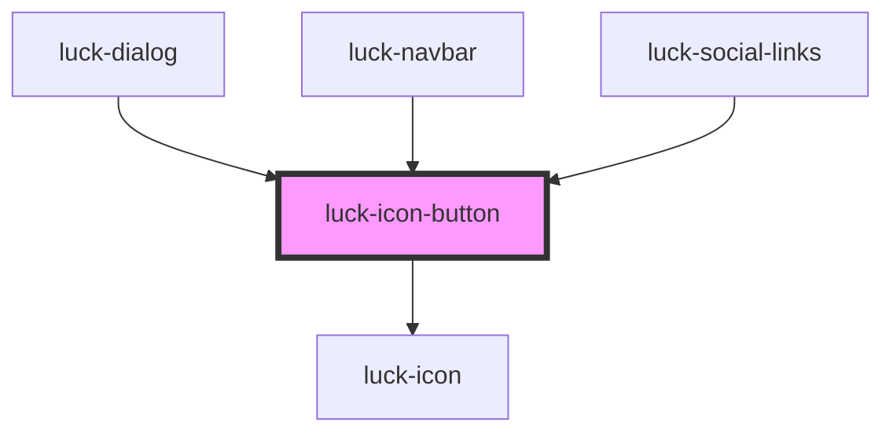

# luck-icon-button

<!-- Auto Generated Below -->

## Overview

Botão tecla só com ícone. O `label` vira nome acessível e dica no hover.
Com `confirm-icon`, o ícone troca por 1,5 s após o clique (ex.: copiar → ✓).

## Properties

| Property             | Attribute       | Description                                      | Type                                  | Default       |
| -------------------- | --------------- | ------------------------------------------------ | ------------------------------------- | ------------- |
| `confirmIcon`        | `confirm-icon`  | Ícone mostrado por 1,5 s após o clique.          | `string \| undefined`                 | `undefined`   |
| `confirmLabel`       | `confirm-label` | Texto anunciado na confirmação.                  | `string`                              | `"Pronto"`    |
| `disabled`           | `disabled`      |                                                  | `boolean`                             | `false`       |
| `expanded`           | `expanded`      | Repassado como `aria-expanded` (menus, painéis). | `boolean \| undefined`                | `undefined`   |
| `href`               | `href`          |                                                  | `string \| undefined`                 | `undefined`   |
| `icon` _(required)_  | `icon`          | Ícone Lucide.                                    | `string`                              | `undefined`   |
| `label` _(required)_ | `label`         | Nome acessível e texto da dica. Obrigatório.     | `string`                              | `undefined`   |
| `rel`                | `rel`           |                                                  | `string \| undefined`                 | `undefined`   |
| `size`               | `size`          |                                                  | `"lg" \| "md" \| "sm"`                | `"md"`        |
| `target`             | `target`        |                                                  | `string \| undefined`                 | `undefined`   |
| `tooltip`            | `tooltip`       | Mostra o `label` como dica no hover e no foco.   | `boolean`                             | `true`        |
| `variant`            | `variant`       |                                                  | `"ghost" \| "primary" \| "secondary"` | `"secondary"` |

## Events

| Event         | Description                           | Type                |
| ------------- | ------------------------------------- | ------------------- |
| `luckConfirm` | Emitido quando a confirmação aparece. | `CustomEvent<void>` |

## Methods

### `setFocus() => Promise<void>`

#### Returns

Type: `Promise<void>`

## Shadow Parts

| Part        | Description                    |
| ----------- | ------------------------------ |
| `"control"` | O `<button>` ou `<a>` interno. |

## Dependencies

### Used by

 - [luck-dialog](../luck-dialog)
 - [luck-navbar](../luck-navbar)
 - [luck-social-links](../luck-social-links)

### Depends on

- [luck-icon](../luck-icon)

### Graph

----------------------------------------------

