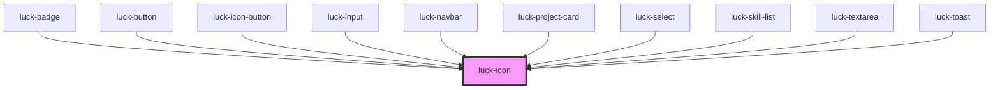

# luck-icon

<!-- Auto Generated Below -->

## Overview

Ícone Lucide (traço 1.75, tamanho 16). O nome segue o kebab-case do Lucide: `arrow-up-right`.
Ícones fora do conjunto padrão entram com `registerIcons` ou `setIconLoader`.

## Properties

| Property            | Attribute      | Description                                                                 | Type                  | Default     |
| ------------------- | -------------- | --------------------------------------------------------------------------- | --------------------- | ----------- |
| `label`             | `label`        | Texto para leitores de tela. Sem ele, o ícone é decorativo (`aria-hidden`). | `string \| undefined` | `undefined` |
| `name` _(required)_ | `name`         | Nome do ícone em kebab-case (`arrow-up-right`, `circle-check`).             | `string`              | `undefined` |
| `size`              | `size`         | Tamanho em px.                                                              | `number`              | `16`        |
| `strokeWidth`       | `stroke-width` | Espessura do traço.                                                         | `number`              | `1.75`      |

## Shadow Parts

| Part    | Description |
| ------- | ----------- |
| `"svg"` |             |

## Dependencies

### Used by

 - [luck-badge](../luck-badge)
 - [luck-button](../luck-button)
 - [luck-icon-button](../luck-icon-button)
 - [luck-input](../luck-input)
 - [luck-navbar](../luck-navbar)
 - [luck-project-card](../luck-project-card)
 - [luck-select](../luck-select)
 - [luck-skill-list](../luck-skill-list)
 - [luck-textarea](../luck-textarea)
 - [luck-toast](../luck-toast)

### Graph

----------------------------------------------

