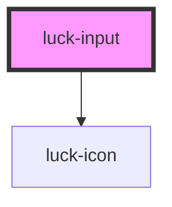

# luck-input

<!-- Auto Generated Below -->

## Overview

Campo de texto rebaixado (poço) com rótulo flutuante. Com `validator`, mostra ✓ quando válido e
balança com a mensagem de erro ao perder o foco. Participa de `<form>` nativo.

## Properties

| Property             | Attribute      | Description                                                        | Type                                                                                  | Default     |
| -------------------- | -------------- | ------------------------------------------------------------------ | ------------------------------------------------------------------------------------- | ----------- |
| `autocomplete`       | `autocomplete` |                                                                    | `string \| undefined`                                                                 | `undefined` |
| `disabled`           | `disabled`     |                                                                    | `boolean`                                                                             | `false`     |
| `error`              | `error`        | Erro controlado de fora. Tem prioridade sobre o `validator`.       | `string \| undefined`                                                                 | `undefined` |
| `hint`               | `hint`         | Texto de ajuda abaixo do campo.                                    | `string \| undefined`                                                                 | `undefined` |
| `icon`               | `icon`         | Ícone Lucide à esquerda.                                           | `string \| undefined`                                                                 | `undefined` |
| `inputmode`          | `inputmode`    |                                                                    | `string \| undefined`                                                                 | `undefined` |
| `label` _(required)_ | `label`        | Rótulo visível (flutua ao focar ou preencher).                     | `string`                                                                              | `undefined` |
| `max`                | `max`          |                                                                    | `string \| undefined`                                                                 | `undefined` |
| `maxlength`          | `maxlength`    |                                                                    | `number \| undefined`                                                                 | `undefined` |
| `min`                | `min`          |                                                                    | `string \| undefined`                                                                 | `undefined` |
| `minlength`          | `minlength`    |                                                                    | `number \| undefined`                                                                 | `undefined` |
| `name`               | `name`         |                                                                    | `string \| undefined`                                                                 | `undefined` |
| `pattern`            | `pattern`      |                                                                    | `string \| undefined`                                                                 | `undefined` |
| `readonly`           | `readonly`     |                                                                    | `boolean`                                                                             | `false`     |
| `required`           | `required`     |                                                                    | `boolean`                                                                             | `false`     |
| `step`               | `step`         |                                                                    | `string \| undefined`                                                                 | `undefined` |
| `type`               | `type`         |                                                                    | `"date" \| "email" \| "number" \| "password" \| "search" \| "tel" \| "text" \| "url"` | `"text"`    |
| `valid`              | `valid`        | Força o estado válido (✓).                                         | `boolean \| undefined`                                                                | `undefined` |
| `validator`          | --             | Função de validação: `true` válido, string com a mensagem de erro. | `((value: string) => string \| boolean) \| undefined`                                 | `undefined` |
| `value`              | `value`        |                                                                    | `string`                                                                              | `""`        |

## Events

| Event        | Description                                                | Type                              |
| ------------ | ---------------------------------------------------------- | --------------------------------- |
| `luckBlur`   |                                                            | `CustomEvent<void>`               |
| `luckChange` | Ao confirmar a mudança (perda de foco com valor alterado). | `CustomEvent<{ value: string; }>` |
| `luckFocus`  |                                                            | `CustomEvent<void>`               |
| `luckInput`  | A cada tecla.                                              | `CustomEvent<{ value: string; }>` |

## Methods

### `setFocus() => Promise<void>`

#### Returns

Type: `Promise<void>`

## Shadow Parts

| Part        | Description          |
| ----------- | -------------------- |
| `"control"` | O `<input>` interno. |

## Dependencies

### Depends on

- [luck-icon](../luck-icon)

### Graph

----------------------------------------------

