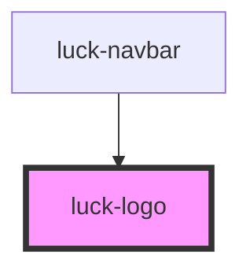

# luck-logo

<!-- Auto Generated Below -->

## Overview

Logo WL3 "Ritmo": três Ls crescendo (0,382 · 0,618 · 1) sobre uma base comum, o último em âmbar.
Não espelhar, girar ou distorcer; nunca azul ou roxo. Mínimo: símbolo 16 px, horizontal 96 px.

## Properties

| Property  | Attribute | Description                                                         | Type                                                                               | Default                  |
| --------- | --------- | ------------------------------------------------------------------- | ---------------------------------------------------------------------------------- | ------------------------ |
| `label`   | `label`   | Nome acessível.                                                     | `string`                                                                           | `"welllucky"`            |
| `motion`  | `motion`  | `rise`: entrada em mola. `press`: tecla no hover (usado na Navbar). | `"none" \| "press" \| "rise"`                                                      | `"none"`                 |
| `name`    | `name`    | Nome na assinatura.                                                 | `string`                                                                           | `"Wellington Braga"`     |
| `reduced` | `reduced` | Versão reduzida do símbolo. Padrão: automática abaixo de 24 px.     | `boolean \| undefined`                                                             | `undefined`              |
| `size`    | `size`    | Altura do símbolo em px (no wordmark, o corpo da fonte).            | `number`                                                                           | `32`                     |
| `tagline` | `tagline` | Linha de apoio na assinatura. Vazio para omitir.                    | `string`                                                                           | `"Código · Design · UX"` |
| `tone`    | `tone`    |                                                                     | `"accent" \| "default" \| "mono" \| "on-accent"`                                   | `"default"`              |
| `variant` | `variant` | `horizontal` é a assinatura principal.                              | `"app-icon" \| "horizontal" \| "signature" \| "stacked" \| "symbol" \| "wordmark"` | `"symbol"`               |

## Dependencies

### Used by

 - [luck-navbar](../luck-navbar)

### Graph

----------------------------------------------

