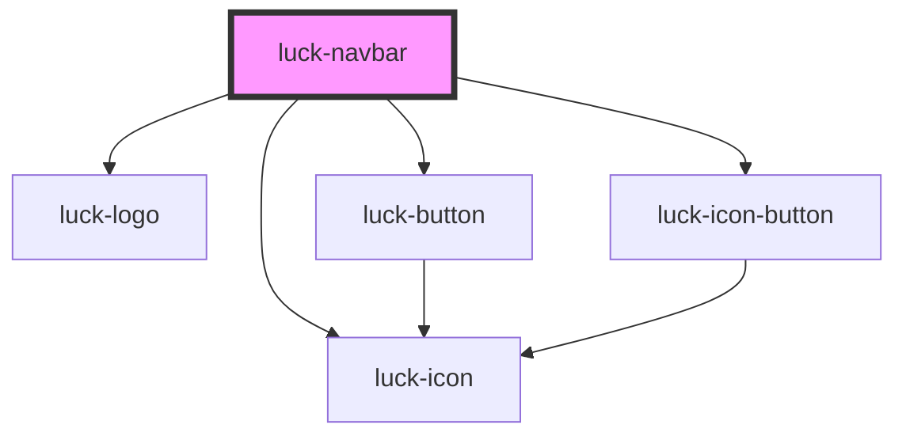

# luck-navbar

<!-- Auto Generated Below -->

## Overview

Barra de navegação: logo que "pressiona" no hover, links com traço âmbar, troca de tema em
círculo e CTA. Abaixo de 760 px vira menu.

Para navegação SPA, chame `preventDefault()` em `luckNavigate` e roteie você mesmo.

## Properties

| Property          | Attribute           | Description                                                          | Type                             | Default            |
| ----------------- | ------------------- | -------------------------------------------------------------------- | -------------------------------- | ------------------ |
| `active`          | `active`            | `value` (ou `href`) do link ativo.                                   | `string \| undefined`            | `undefined`        |
| `brandHref`       | `brand-href`        | Link da logo.                                                        | `string`                         | `"/"`              |
| `closeMenuLabel`  | `close-menu-label`  |                                                                      | `string`                         | `"Fechar menu"`    |
| `ctaHref`         | `cta-href`          |                                                                      | `string \| undefined`            | `undefined`        |
| `ctaIcon`         | `cta-icon`          |                                                                      | `string`                         | `"arrow-up-right"` |
| `ctaLabel`        | `cta-label`         |                                                                      | `string \| undefined`            | `undefined`        |
| `links`           | `links`             | Links: `[{ label, href, value? }]`. Via atributo, em JSON.           | `NavLink[] \| string`            | `[]`               |
| `menuLabel`       | `menu-label`        |                                                                      | `string`                         | `"Abrir menu"`     |
| `showThemeToggle` | `show-theme-toggle` |                                                                      | `boolean`                        | `true`             |
| `theme`           | `theme`             | Tema controlado. Sem ele, o botão troca o `data-theme` do documento. | `"dark" \| "light" \| undefined` | `undefined`        |

## Events

| Event             | Description                                                                        | Type                                                          |
| ----------------- | ---------------------------------------------------------------------------------- | ------------------------------------------------------------- |
| `luckCta`         | Clique no CTA.                                                                     | `CustomEvent<void>`                                           |
| `luckNavigate`    | Clique em um link. Cancelável: `preventDefault()` impede a navegação nativa.       | `CustomEvent<{ value: string; href?: string \| undefined; }>` |
| `luckThemeChange` | Pedido de troca de tema. Cancelável: `preventDefault()` impede a troca automática. | `CustomEvent<{ theme: Theme; }>`                              |

## Slots

| Slot        | Description                |
| ----------- | -------------------------- |
| `"actions"` | Ações extras antes do CTA. |
| `"brand"`   | Substitui a logo.          |

## Dependencies

### Depends on

- [luck-logo](../luck-logo)
- [luck-icon](../luck-icon)
- [luck-button](../luck-button)
- [luck-icon-button](../luck-icon-button)

### Graph

----------------------------------------------

