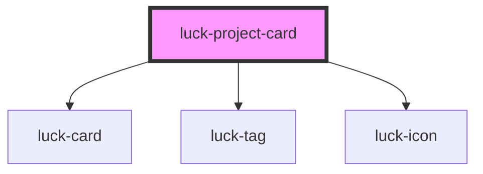

# luck-project-card

<!-- Auto Generated Below -->

## Overview

Card de projeto do portfólio: mídia com paralaxe, tags mono, empresa em azul e link com seta que voa.
O card inclina em 3D sob o cursor.

## Properties

| Property               | Attribute     | Description                                                      | Type                   | Default         |
| ---------------------- | ------------- | ---------------------------------------------------------------- | ---------------------- | --------------- |
| `company`              | `company`     | Empresa (sinalizada em azul).                                    | `string \| undefined`  | `undefined`     |
| `description`          | `description` |                                                                  | `string \| undefined`  | `undefined`     |
| `heading` _(required)_ | `heading`     |                                                                  | `string`               | `undefined`     |
| `href`                 | `href`        |                                                                  | `string`               | `"#"`           |
| `image`                | `image`       | URL da imagem de capa.                                           | `string \| undefined`  | `undefined`     |
| `imageBg`              | `image-bg`    |                                                                  | `string`               | `"#F3F3F3"`     |
| `imageFit`             | `image-fit`   | `contain` centraliza a marca a 58 % da altura; `cover` preenche. | `"contain" \| "cover"` | `"contain"`     |
| `index`                | `index`       | Índice na barra do card: `01`.                                   | `string \| undefined`  | `undefined`     |
| `linkLabel`            | `link-label`  |                                                                  | `string`               | `"Ver projeto"` |
| `period`               | `period`      |                                                                  | `string \| undefined`  | `undefined`     |
| `tags`                 | `tags`        | Tecnologias: array, JSON ou lista separada por vírgulas.         | `string \| string[]`   | `[]`            |

## Events

| Event      | Description                                                                                | Type                             |
| ---------- | ------------------------------------------------------------------------------------------ | -------------------------------- |
| `luckOpen` | Clique no link. Cancelável: `preventDefault()` impede a navegação (ex.: abrir um diálogo). | `CustomEvent<{ href: string; }>` |

## Dependencies

### Depends on

- [luck-card](../luck-card)
- [luck-tag](../luck-tag)
- [luck-icon](../luck-icon)

### Graph

----------------------------------------------

