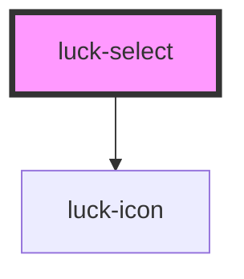

# luck-select

<!-- Auto Generated Below -->

## Overview

Seleção nativa no poço rebaixado, com rótulo fixo e chevron que gira no foco.
Opções via `options` (array ou JSON) ou `<option>` filhos.

## Properties

| Property             | Attribute     | Description                                                                     | Type                       | Default     |
| -------------------- | ------------- | ------------------------------------------------------------------------------- | -------------------------- | ----------- |
| `disabled`           | `disabled`    |                                                                                 | `boolean`                  | `false`     |
| `error`              | `error`       |                                                                                 | `string \| undefined`      | `undefined` |
| `hint`               | `hint`        |                                                                                 | `string \| undefined`      | `undefined` |
| `icon`               | `icon`        |                                                                                 | `string \| undefined`      | `undefined` |
| `label` _(required)_ | `label`       |                                                                                 | `string`                   | `undefined` |
| `name`               | `name`        |                                                                                 | `string \| undefined`      | `undefined` |
| `options`            | `options`     | `["A","B"]` ou `[{ value, label, disabled? }]`. Também aceita JSON no atributo. | `SelectOption[] \| string` | `[]`        |
| `placeholder`        | `placeholder` | Opção vazia e desabilitada mostrada enquanto nada foi escolhido.                | `string \| undefined`      | `undefined` |
| `required`           | `required`    |                                                                                 | `boolean`                  | `false`     |
| `value`              | `value`       |                                                                                 | `string`                   | `""`        |

## Events

| Event        | Description                                 | Type                              |
| ------------ | ------------------------------------------- | --------------------------------- |
| `luckBlur`   |                                             | `CustomEvent<void>`               |
| `luckChange` | Emitido quando o usuário escolhe uma opção. | `CustomEvent<{ value: string; }>` |
| `luckFocus`  |                                             | `CustomEvent<void>`               |

## Methods

### `setFocus() => Promise<void>`

#### Returns

Type: `Promise<void>`

## Slots

| Slot | Description      |
| ---- | ---------------- |
|      | The default slot |

## Shadow Parts

| Part        | Description           |
| ----------- | --------------------- |
| `"control"` | O `<select>` interno. |

## Dependencies

### Depends on

- [luck-icon](../luck-icon)

### Graph

----------------------------------------------

