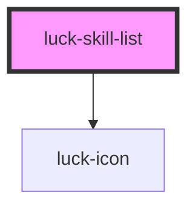

# luck-skill-list

<!-- Auto Generated Below -->

## Overview

Lista de conhecimentos em sanfona (uma aberta por vez). Ícones em roxo, o sinal de conhecimento.

## Properties

| Property | Attribute | Description                                                           | Type                    | Default |
| -------- | --------- | --------------------------------------------------------------------- | ----------------------- | ------- |
| `items`  | `items`   | Itens: `[{ title, icon?, stack?, summary? }]`. Via atributo, em JSON. | `SkillItem[] \| string` | `[]`    |
| `open`   | `open`    | Índice aberto. `-1` fecha todos.                                      | `number`                | `0`     |

## Events

| Event        | Description | Type                              |
| ------------ | ----------- | --------------------------------- |
| `luckToggle` |             | `CustomEvent<{ index: number; }>` |

## Dependencies

### Depends on

- [luck-icon](../luck-icon)

### Graph

----------------------------------------------

