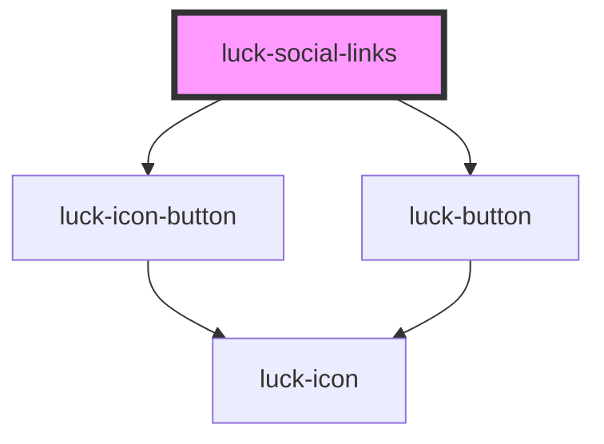

# luck-social-links

<!-- Auto Generated Below -->

## Overview

Redes sociais como teclas de ícone (com dica) ou botões com rótulo.

## Properties

| Property  | Attribute | Description                                                  | Type                     | Default  |
| --------- | --------- | ------------------------------------------------------------ | ------------------------ | -------- |
| `links`   | `links`   | Links: `[{ network, href, label? }]`. Via atributo, em JSON. | `SocialLink[] \| string` | `[]`     |
| `size`    | `size`    |                                                              | `"lg" \| "md" \| "sm"`   | `"md"`   |
| `variant` | `variant` |                                                              | `"button" \| "icon"`     | `"icon"` |

## Dependencies

### Depends on

- [luck-icon-button](../luck-icon-button)
- [luck-button](../luck-button)

### Graph

----------------------------------------------

