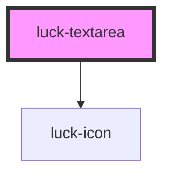

# luck-textarea

<!-- Auto Generated Below -->

## Overview

Área de texto rebaixada com rótulo flutuante e validação igual à do `luck-input`.

## Properties

| Property             | Attribute   | Description                                                        | Type                                                  | Default     |
| -------------------- | ----------- | ------------------------------------------------------------------ | ----------------------------------------------------- | ----------- |
| `disabled`           | `disabled`  |                                                                    | `boolean`                                             | `false`     |
| `error`              | `error`     |                                                                    | `string \| undefined`                                 | `undefined` |
| `hint`               | `hint`      |                                                                    | `string \| undefined`                                 | `undefined` |
| `label` _(required)_ | `label`     |                                                                    | `string`                                              | `undefined` |
| `maxlength`          | `maxlength` |                                                                    | `number \| undefined`                                 | `undefined` |
| `minlength`          | `minlength` |                                                                    | `number \| undefined`                                 | `undefined` |
| `name`               | `name`      |                                                                    | `string \| undefined`                                 | `undefined` |
| `readonly`           | `readonly`  |                                                                    | `boolean`                                             | `false`     |
| `required`           | `required`  |                                                                    | `boolean`                                             | `false`     |
| `rows`               | `rows`      |                                                                    | `number`                                              | `4`         |
| `valid`              | `valid`     |                                                                    | `boolean \| undefined`                                | `undefined` |
| `validator`          | --          | Função de validação: `true` válido, string com a mensagem de erro. | `((value: string) => string \| boolean) \| undefined` | `undefined` |
| `value`              | `value`     |                                                                    | `string`                                              | `""`        |

## Events

| Event        | Description | Type                              |
| ------------ | ----------- | --------------------------------- |
| `luckBlur`   |             | `CustomEvent<void>`               |
| `luckChange` |             | `CustomEvent<{ value: string; }>` |
| `luckFocus`  |             | `CustomEvent<void>`               |
| `luckInput`  |             | `CustomEvent<{ value: string; }>` |

## Methods

### `setFocus() => Promise<void>`

#### Returns

Type: `Promise<void>`

## Shadow Parts

| Part        | Description             |
| ----------- | ----------------------- |
| `"control"` | O `<textarea>` interno. |

## Dependencies

### Depends on

- [luck-icon](../luck-icon)

### Graph

----------------------------------------------

