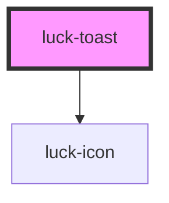

# luck-toast

<!-- Auto Generated Below -->

## Overview

Aviso curto e humano: "Mensagem enviada · Respondo em até 2 dias úteis." A barra inferior conta o
tempo e pausa no hover. Para empilhar avisos na tela, use `showToast()` de `@welllucky/luck-core`.

## Properties

| Property               | Attribute     | Description                                         | Type                                               | Default          |
| ---------------------- | ------------- | --------------------------------------------------- | -------------------------------------------------- | ---------------- |
| `closeLabel`           | `close-label` |                                                     | `string`                                           | `"Fechar"`       |
| `description`          | `description` |                                                     | `string \| undefined`                              | `undefined`      |
| `duration`             | `duration`    | Tempo até fechar sozinho, em ms. `0` mantém aberto. | `number`                                           | `4000`           |
| `heading` _(required)_ | `heading`     |                                                     | `string`                                           | `undefined`      |
| `icon`                 | `icon`        | Ícone Lucide.                                       | `string`                                           | `"circle-check"` |
| `tone`                 | `tone`        |                                                     | `"accent" \| "company" \| "danger" \| "knowledge"` | `"accent"`       |

## Events

| Event       | Description                                 | Type                |
| ----------- | ------------------------------------------- | ------------------- |
| `luckClose` | Emitido quando a animação de saída termina. | `CustomEvent<void>` |

## Methods

### `dismiss() => Promise<void>`

Fecha o aviso com a animação de saída.

#### Returns

Type: `Promise<void>`

## Slots

| Slot       | Description                                                                           |
| ---------- | ------------------------------------------------------------------------------------- |
| `"action"` | Ação opcional (ex.: `<luck-button size="sm" variant="ghost">Desfazer</luck-button>`). |

## Dependencies

### Depends on

- [luck-icon](../luck-icon)

### Graph

----------------------------------------------

